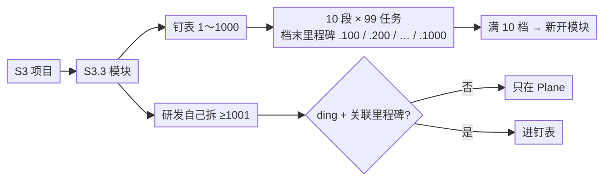

# 钉表 / Plane 取号 —— 说明

> 细则：[dingtalk-hierarchy-naming.md](dingtalk-hierarchy-naming.md) · 可打印：[dingtalk-hierarchy-取号说明.html](dingtalk-hierarchy-取号说明.html)

**是什么**：钉表用 **1～1000**（10 段，档末是里程碑）；Plane 里研发自己拆的任务从 **1001** 起，默认不进钉表；一个模块最多 **10 个**里程碑，满了开新模块。

**为什么重要**：看板和业务表靠同一套号对齐。号乱了别人找不到你的活；造同名空任务会让两边各有一套假进度。

**怎么做**：新建看标题旁选项；取段内最小空洞；表上已有的别再造壳。

名字：`S3.3 功能开发` / `S3.3.15 某某` / `MS3.3.100 某某`（码和标题**一个空格**）。别给同一代号再造第二种写法。

**段内取号**：先建里程碑再补任务也行；取该段**最小空洞**（删过 `.5` 就先补 `.5`，不是一直 `max+1`）。里程碑号只能是 `100/200/…/1000`。

---

## 你怎么喊 AI（触发词）

| 你说（可原样粘贴）                                      | AI 该做什么                                  |
| ------------------------------------------------------- | -------------------------------------------- |
| **取号** / **怎么取号** / **钉表编号** / **Plane 编号** | 读本说明 + naming；按控件规则解释该拿什么号  |
| **补空洞** / **不要 max+1** / **最小空号**              | 按段内最小空洞取号，禁止只会往后加           |
| **造壳** / **同名空任务** / **禁止再新建同名模块**      | 对照钉表已有项；禁止再建同代号空壳           |
| **进钉表** / **打 ding** / **细号怎么进业务表**         | 说明 ≥1001 默认不进；要进须 ding + 标题带码  |
| **关联里程碑是不是父子**                                | 澄清：只记逻辑归属、不改号，**不是**父子任务 |
| **按 dingtalk-hierarchy** / **按取号说明**              | 打开 naming / 本页纸执行                     |

父子挂接：属性「模块」=`milestone`（depth-1）；「父项」=`parent_issue`（**钉钉三级** depth-2 Issue）。日常提交要么直接对三级，要么是三级下的细分。细则见 [task-relationships](task-relationships.md)。Focus（大任务和细任务怎么挂）见 [ai-native-daily §2.1](ai-native-daily.md#21-会话-focus-绑定钉表优先--agent-择优-abc)。

---

## Plane 新建（控件在标题旁边）

| 你怎么选             | 拿到什么号                                 |
| -------------------- | ------------------------------------------ |
| 勾选「是否为里程碑」 | 下一个空槽 `.100` / `.200` / …（钉表档末） |
| 关联某个里程碑       | 仍 ≥1001；只记归属，**不改号**             |
| 都不选               | ≥1001（研发自己拆的）                      |

勾选「是否为里程碑」会**自动换标号**；换关联**不换号**。你手改整段标题且没再点「是否为里程碑」→ 系统不抢改。换项目/模块会重取号。关联里程碑不是父子任务。

---

## Plane 里拆的任务怎么进钉表

默认不进。要进：模块已在钉表 + 打 `ding` 标签 + 标题带层级码。关联里程碑是可选的（仅影响进表后的逻辑归属）；不关联也能进。进表后挂在模块下，排序由钉表按层级码排。

钉表说了算：表上已有的模块/大任务，别在 Plane 再造同名空壳。

---

细则 / 台账 / 父子取号：[naming](dingtalk-hierarchy-naming.md) · [task-naming](task-naming.md) · [task-relationships](task-relationships.md)  
跟 AI 干活（角色+会话，另一张）：[跟AI开发-角色与会话-说明](跟AI开发-角色与会话-说明.md)
