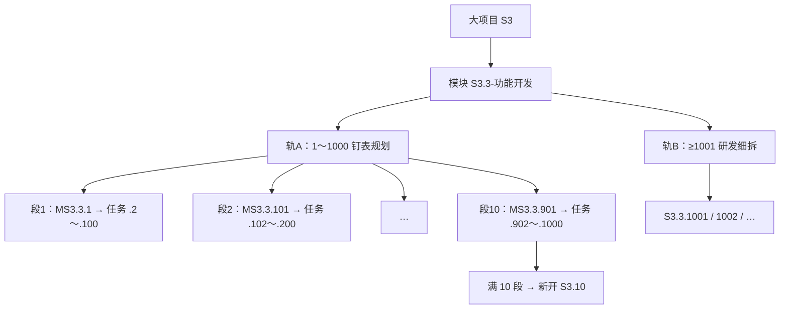

# 钉表 / Plane 取号 —— 通俗说明

> 给人听、给人看。契约细则见 [dingtalk-hierarchy-naming.md](dingtalk-hierarchy-naming.md)。  
> 实现：`repos/my-plane/.../dingtalk_sync/README.md`

一句话：**钉表管「看得见的计划号 1～1000」，研发细拆从 1001 起；里程碑每模块最多 10 个，满了就新开模块。**

---

## 取号示意图（一张树）

从上往下只分叉一次：模块下 **左轨钉表 / 右轨研发**。用 Markdown 预览打开即可看到图（勿用纯文本代码块画树）。

Plane 新建怎么进哪一轨：

| 你怎么建       | 进哪                                     |
| -------------- | ---------------------------------------- |
| 勾选「里程碑」 | 轨A，占下一个空里程碑槽（.1 / .101 / …） |
| 关联某个里程碑 | 轨A，该段内任务号 max+1                  |
| 都不选         | 轨B，≥1001                               |

---

## 1. 楼层怎么排

钉表和 Plane 用同一套「带点号」的编码对齐：

| 楼层          | 例子               | 是什么       |
| ------------- | ------------------ | ------------ |
| 大项目        | `S3` / `P6` / `P3` | Plane 项目   |
| 子项目 / 模块 | `S3.3` / `P6.11`   | Plane Module |
| 具体任务      | `S3.3.15`          | Plane Issue  |

名字写法：

- 模块：`S3.3-功能开发`（短横线）
- 任务：`S3.3.15 · 某某对接`（中点）

别混着写，否则 Plane 里容易长出两个同名模块。

---

## 2. 号码分两拨（最重要）

每个**模块**下面，号码分成两轨：

| 轨              | 号码        | 给谁用                                                          |
| --------------- | ----------- | --------------------------------------------------------------- |
| 钉表 / 正式规划 | **1～1000** | 华茂钉表上的里程碑和钉表任务；Plane 里勾选/关联里程碑时也走这段 |
| 研发细拆        | **≥1001**   | Plane / `da pm` 里临时拆的细任务，默认不往钉表塞                |

可以想成：前 1000 个号是「表上看得见的计划」；1001 往后是「开发自己开的工单号」。

日常台账新建细任务：从 **1001** 起往后加。取号前看一眼 Plane 上已有最大号；**不要**死盯本地 `meta.next_task_id`。

---

## 3. 1～1000 里怎么排里程碑（10 × 99）

把 1～1000 切成 **10 段**，每段约 100 个号：

- 每段**开头**那个号（1、101、201 … 901）是**里程碑**（名字常带 `M`，如 `MS3.3.1`）
- 同一段后面最多 **99 个任务**跟着这个里程碑
- 一个模块最多 **10 个钉表里程碑**；要开第 11 个 → **新开模块**（如 `S3.10`），并跟表格维护方说一声

---

## 4. Plane 上新建注意

「关联里程碑」只是告诉系统**落在哪一段号里**，不是 Plane 里父子任务那种 parent。

---

## 5. 三条红线

1. **钉表说了算**：表上已有的模块/大任务，别在 Plane 再造一套同名壳。
2. **钉表任务别超过 .1000**：同一模块写满就拆模块；`.1001+` 留给 Plane / 研发。
3. **细任务从 1001 起**：别跟钉表大颗粒抢号。

---

## 延伸阅读

- 契约全文：[dingtalk-hierarchy-naming.md](dingtalk-hierarchy-naming.md)
- 台账登记：[task-naming.md](task-naming.md)
- 父子 / 取号 floor：[task-relationships.md](task-relationships.md)
