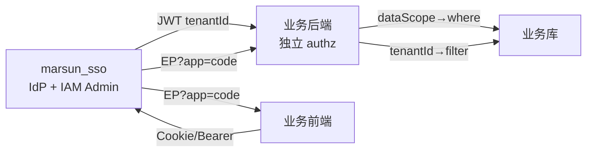

# IAM SSO 全量接入 Playbook

> 定位：业务系统全量接入 marsun_sso 的可执行 playbook + 参考实现 walkthrough + 无 SSO 仓协作 + SSO 配置项参考。
> walkthrough：Assets + S3 + [myFlow](references/07-example-myflow-walkthrough.md)（SystemApp=`myflow-agent`，Admin 显示名≠「Dify」）。
> 检查表 SSOT 仍指向 [iam-system-onboard-新系统IAM接入齐套](../../../frontend-dev-spec/references/business/iam-system-onboard-新系统IAM接入齐套.md)，本 Skill 不复制其 1–16 条。
>
> ⚠️ **阶段 2 硬提醒（血泪）**：写好 `<app>PermissionCatalog.ts` ≠ Admin 已出现系统/权限点。  
> **代码合入后必须本机执行** `db:import-<app>-permissions`（+ 建议 `BIND_ADMIN=1`）与 `db:sync-<app>-role-matrix`，或 AskQuestion 让用户明确「延期灌库」。  
> **禁止**把「prod-safety 不碰生产」误当成「本机也不灌库、也不强提醒」。缺 import 执行记录 → **禁宣称阶段 2 完成 / 禁进阶段 3 验收口径**。
>
> ⚠️ **`sys:<app>` 入口**：`ensureSystemAppEntryPermissions` **扫 DB `SystemApp` 动态保障**，禁止再维护手写 `specs[]`。先建/import 出 SystemApp 行，再 ensure/import。  
> ⚠️ **Admin 绑权左侧**：须提供中文 `*PermissionBindCatalog`（接 `BindPermissionsModal`）；**禁止**靠 PermissionBindPanel 的 code 前缀英文回退做验收。

## 架构



- JWT 携带 `tenantId`（主归属租户）；Cookie `marsun_session` 或 `Authorization: Bearer` 双通道。
- **细粒度权限唯一来源**：`GET /api/iam/me/effective-permissions?app=<SystemApp.code>`（EP）。
- EP 返回 `permissions[].code` + `roleCodes` + `dataScope`。
- FE 拉一次 EP 存快照（`iamPermissionCodes`），侧栏/路由/按钮读快照。
- BE PEP 每次请求拉 EP（短缓存），`requirePermission(code)` 挂读/写 API。
- dataScope → SQL/Prisma `where`（行级可见）。
- tenantId → 强制 `where tenantId`（正交于上三层，永远在）。

## 红线

见 marsun_sso 仓 `docs/integration-guide.md` · [05-tenant-isolation](../../../rules/05-tenant-isolation.mdc) · [04-no-api-mock](../../../rules/04-no-api-mock.mdc)。

1. **细权限只认 EP**，禁止用 JWT `role` / `roleCodes` 做 `requirePermission` / 数据过滤。
2. 各 App **独立** `*_IAM_AUTHZ_MODE`（Assets=`IAM_AUTHZ_MODE`，S3=`S3_IAM_AUTHZ_MODE`），勿共用。
3. 权限点**必须挂读/写 API**（`requirePermission`），不能只藏按钮。
4. 生产 `TENANT_ID_STRICT=true`（缺 tenantId → 401）。
5. 无 SSO PR 权**禁止宣称 G1**（见 [01-without-sso-repo](references/01-without-sso-repo-无仓协作.md)）。

## 四层权限模型

权限码不只用于展示，还用于数据获取。四层正交：

| 层        | 来源         | 作用                                 | 谁负责             | 详见                                                        |
| --------- | ------------ | ------------------------------------ | ------------------ | ----------------------------------------------------------- |
| 菜单码    | EP codes     | 侧栏/路由可见                        | FE route guard     | [04-data-vs-shell](references/04-data-vs-shell-权限四层.md) |
| 动作码    | EP codes     | 按钮可见 + **API requirePermission** | FE button + BE dep | 同上                                                        |
| dataScope | EP dataScope | **列表/统计 SQL where**              | BE adapter         | 同上                                                        |
| tenantId  | JWT          | **强制行级过滤**（正交）             | BE middleware      | 同上                                                        |

## 全量接入流程

1. **产品码表**：岗 → SSO Role → 菜单码/动作码 → dataScope；功能与权限点清单。见 iam-system-onboard §1–4。
2. **SSO 侧**：SystemApp + `sys:<app>` 入口 + catalog import + 角色矩阵 + 试点任命。见 [01-without-sso-repo](references/01-without-sso-repo-无仓协作.md)。
3. **FE 壳**：EP 拉取 + store 分桶 + Bridge 真实 hasPermission + 路由门禁。见 [02-assets](references/02-example-assets-walkthrough.md) / [03-s3](references/03-example-s3-walkthrough.md)。
4. **BE PEP**：`requirePermission(code)` 挂读/写 API；dual 观测 → iam 硬拒绝。
5. **BE dataScope**：EP.dataScope → 列表/统计 where。
6. **BE tenant**：JWT tenantId 强制过滤；STRICT 缺则 401。
7. **验收**：见 [05-checklist](references/05-checklist-验收勾选.md)；role-loop §2.5 命中必跑。

## SSO 配置项

平台级配置（CORS/Redirect/Session 等）已可视化：见 [00-sso-config](references/00-sso-config-配置项.md)。
密钥类（JWT_SECRET/DATABASE_URL/OIDC_*）仍留 `.env`。

## 双 walkthrough + myFlow

- Node/Prisma 后端 + React 前端：[02-example-assets-walkthrough](references/02-example-assets-walkthrough.md)
- Python/FastAPI 后端 + React 前端双仓：[03-example-s3-walkthrough](references/03-example-s3-walkthrough.md)
- Dify 白标 + Session Bridge + ops-console：[07-example-myflow-walkthrough](references/07-example-myflow-walkthrough.md)

## 逐步 TODO 模板

新系统从零接 SSO 的可勾选 TODO（七阶段，粒度对齐 Plan P1–P10）：[06-new-system-todo-template](references/06-new-system-todo-template-新系统逐步TODO模板.md)

## 阶段闸门与 role-loop 绑定

> 接入不是「闷头做完再交」，而是**每阶段一道闸门**：命中 role-loop 场景必跑 → 输出「必须改/建议改/可接受」表 → **未经用户确认禁止擅自改方案或开写下一阶段代码**（[role-loop §4](../role-loop-review-角色循环验证.md)）。
> 人读一页纸（角色+循环验证+会话）：[跟AI开发-角色与会话-说明.md](../跟AI开发-角色与会话-说明.md)。

| 阶段        | 必跑 role-loop                             | 停手条件                                                                                                                                                                                                                                                                                | 产物落盘（硬要求）                                                                                                                              |
| ----------- | ------------------------------------------ | --------------------------------------------------------------------------------------------------------------------------------------------------------------------------------------------------------------------------------------------------------------------------------------- | ----------------------------------------------------------------------------------------------------------------------------------------------- |
| 1 码表      | **§2.1 需求**（必跑）                      | 码表/权限点清单未经产品+后端+前端三方确认 → 禁进阶段 2                                                                                                                                                                                                                                  | `docs/<系统>/权限点清单.md`                                                                                                                     |
| 2 SSO 侧    | **§2.5 安全**（catalog/矩阵/绑权命中必跑） | ① 无 SSO PR 权 + Admin 也无权建 SystemApp → 停在 2.1，禁宣称 G1；② **catalog 已合入但未本机 import/sync（且用户未书面延期）→ 禁宣称阶段 2 完成**；③ SystemApp 已入库但 `sys:<app>` 缺失（ensure 未跑或未先建 App）→ 必须改；④ Admin 绑权左侧英文前缀回退（缺中文 Bind catalog）→ 必须改 | `…PermissionCatalog.ts` + **SSO Admin FE `*PermissionBindCatalog`** + **终端 import/sync JSON**（`missingPermissionCodes: []`，含 `sys:<app>`） |
| 3 FE 壳     | **§2.3 前端**（建议跑）                    | 侧栏/门禁有「必须改」未确认 → 不继续                                                                                                                                                                                                                                                    | `src/api/iamPermissions.ts` + `PERMISSIONS` 常量（与 catalog 同 diff）                                                                          |
| 4 BE PEP    | **§2.2 接口**（若改 REST 必跑）            | 接口有「必须改」未确认 → 不继续                                                                                                                                                                                                                                                         | `requirePermission` 挂载点清单 + dual 观测日志抽样                                                                                              |
| 5 dataScope | §2.2（同上，若改列表/统计接口）            | 同上                                                                                                                                                                                                                                                                                    | `…-DataScope-Adapter声明-v1.md`                                                                                                                 |
| 6 tenant    | —                                          | —                                                                                                                                                                                                                                                                                       | `tenantWhere` 覆盖清单 + STRICT 配置记录                                                                                                        |
| 7 验收      | **§2.4 测试 + §2.5 安全**（必跑）          | 未确认 → 禁宣称 G1                                                                                                                                                                                                                                                                      | 证据链条 `…接线证据链条与记录-v1.md` + WorkRecord + Plane 台账                                                                                  |

**说人话**：每道闸门处，Agent 须用**白话复述本阶段目标 + 风险**（不堆术语），再 AskQuestion 等用户确认。复述骨架：

```text
本阶段做：<一句话，如「列清楚这个系统要哪些菜单码/动作码/数据范围」>
风险：<一句话，如「码漏了后面 SSO 灌权会缺、FE 侧栏会少项」>
请确认码表 / 指出要改 / 跳过。
```

**产物落盘硬要求**：每阶段结束须勾选产物路径（见 [06 模板](references/06-new-system-todo-template-新系统逐步TODO模板.md) 各阶段「产物」行）。缺产物 → §2.1 或 §2.4 标「必须改」，禁宣称本阶段完成。

**role-loop 硬规则**（[§4](../role-loop-review-角色循环验证.md)）：

1. 有「必须改」默认停手等用户；仅「建议改」可请用户勾选。
2. 禁擅自续修：未确认前不进下一阶段。
3. 不替代门禁：role-loop 通过 ≠ 免除 vitest / 契约用例 / `da standards scan`。

## 验收

见 [05-checklist-验收勾选](references/05-checklist-验收勾选.md)。
**role-loop §2.5** 命中（改权限码/矩阵/绑权/侧栏门禁、auth/密钥/.env、生产 SSH/DB、租户隔离）必跑：[role-loop-review §2.5](../role-loop-review-角色循环验证.md)。
**全场景闸门**（§2.1/§2.3/§2.4/§2.5）见 [05-checklist「role-loop 全场景闸门」](references/05-checklist-验收勾选.md)。

## 与现有 SSOT 关系

- 检查表 1–16：[iam-system-onboard §1](../../../frontend-dev-spec/references/business/iam-system-onboard-新系统IAM接入齐套.md)，本 Skill 不复制。
- 改已有权限码：[permissions-catalog-改权限齐套](../../../frontend-dev-spec/references/business/permissions-catalog-改权限齐套.md)。
- 租户隔离：[05-tenant-isolation.mdc](../../../rules/05-tenant-isolation.mdc)。
- 接入契约：marsun_sso 仓 `docs/integration-guide.md`。
